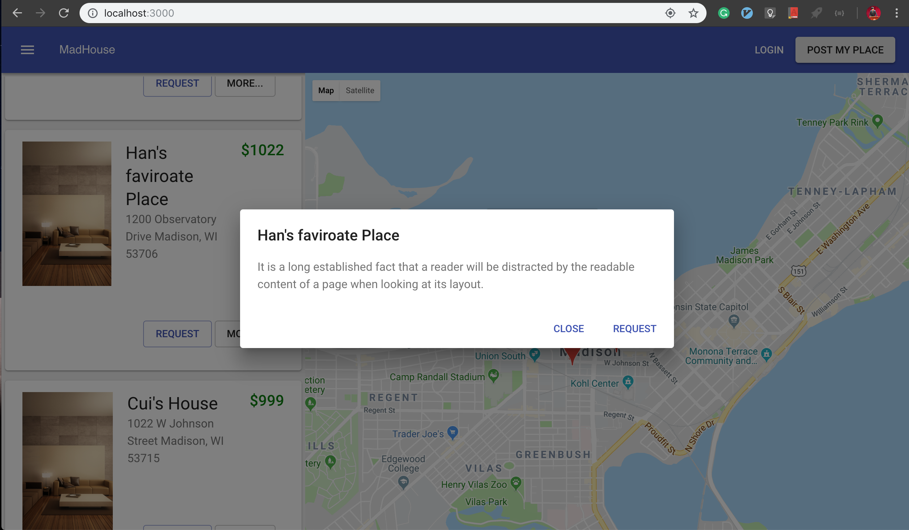

# MadHouseHR (A winner project of MadHacks2018)

Since that I intent to make MadHouse become a startup company eventually, I don't want to go completly open source.
This repository is only for internship hunting summer 2019. 

## Inspiration
As university students who rent apartments off campus, we are often required to rent them for a full year. However, most students will be away during summer, which leaves the apartments vacant for almost three months. We think this is extremely wasteful. On the other hand, summer school attendees come to the university in that particular time period and have the need for accommodations. We believe it will be great if an app and match the two groups to better utilized the apartment spaces.

## What it does
The app collects information from apartment owners/renters who are willing to provide their space for summer students. Other users can then search for the post and sublease the properties. Since the apartments will likely to have spaces like living rooms, they can also be used for storage. The app tries to arrange that as well.

## How I built it
Using React.Js as a front-End, we built a couple of modules to consist the user interface, including a Map and a List of information. The Map supports to show the markers of each storage locations that near your current geolocation. The interface also allows users to post and browse others' information.

Express.js as backend built RESTful API, Authentication...,

MongoDB as the database enables us to improve our ORM easily. Also as a startup company, we wish that we are able to expand our database horizontally. 

## What's next for MadHouse
Being able to actually serve students in UW-Madison

## Setting Up

- React(Front-end)
- Express(Back-end)
- MongoDB(DB)

### React
npm install
npm start

### Express
npm install
nodemon index
(if you did not install nodemon)
npm install -g nodemon

### MongoDB
https://docs.mongodb.com/manual/installation/

### Tools that you are suppose to know
This tool helps you to test APIs 
- Postman: https://www.getpostman.com

A simple GUI for MongoDB
- Robo3T: https://robomongo.org/download
